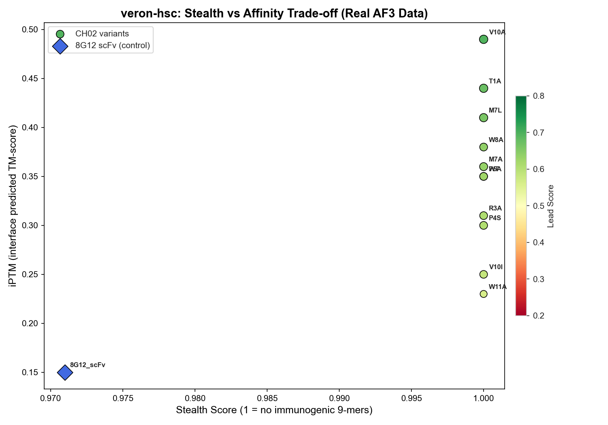

# veron-hsc

**AI-driven engineering of stealth LNP ligands for CD34+ hematopoietic stem cell targeting.**

This pipeline combines [AlphaFold 3](https://alphafoldserver.com) structure prediction with multi-allele MHC-I immunogenicity screening to optimize the CH02 peptide motif (`THRPPMWSPVWP`) for high-affinity CD34 binding while minimizing immune detection.

---

## Key Result

**CH02_V10A** (Val to Ala at position 10) emerged as the top lead from a panel of 12 candidates:

| Metric | V10A | Wild Type | Delta |
|--------|:----:|:---------:|:-----:|
| Lead Score | **0.695** | 0.626 | +11% |
| iPTM (binding confidence) | **0.490** | 0.350 | +40% |
| MWSP Motif Distance | **4.1 A** | 5.3 A | 1.2 A closer |
| Met6 Burial Depth | **1.79 A** | 5.70 A | 3.91 A deeper |
| HLA-A\*01:01 / A\*02:01 | Clean | Clean | -- |
| HLA-C\*07:01 IC50 | 449 nM | -- | Borderline (500 nM threshold) |

The Val to Ala mutation eliminates a C-terminal steric clash, pivoting the backbone to bury the MWSP pharmacophore deeper into the CD34 receptor surface.

> **Data source:** Structural metrics are from real AlphaFold 3 Server predictions. MHC screening uses MHCflurry 2.2 against a 3-allele panel (HLA-A\*01:01, A\*02:01, B\*07:02).

## Stealth vs. Affinity Landscape



Each point is a candidate variant. Color encodes lead score (green = high). Size encodes ligand pLDDT confidence. The 8G12 scFv positive control (blue diamond) binds strongly but is penalized for immunogenicity.

---

## Quick Start

### Prerequisites

- [Miniforge](https://github.com/conda-forge/miniforge) (recommended for Apple Silicon) or Conda
- macOS with Apple M-series GPU (OpenCL) or Linux with CUDA

### Installation

```bash
# Create and activate the environment
conda env create -f environment.yml -p ./veron-hsc
conda activate ./veron-hsc

# Download MHCflurry models (required for immunogenicity screening)
mhcflurry-downloads fetch models_class1_presentation
```

### Running the Pipeline

```bash
# 1. Fetch and energy-minimize the CD34 receptor structure
./veron-hsc/bin/python scripts/preprocess.py

# 2. Generate AF3 input JSONs + run multi-allele MHC screening
./veron-hsc/bin/python scripts/run_screening.py

# 3. Consolidate JSONs into a single bulk-upload manifest
./veron-hsc/bin/python scripts/consolidate_jsons.py
#    Upload results/veron_master_manifest.json to alphafoldserver.com

# 4. Download result zips to results/af3_outputs/, then ingest
./veron-hsc/bin/python scripts/ingest_results.py

# 5. Run the quality gate and produce final rankings
./veron-hsc/bin/python scripts/postprocess.py

# 6. (Optional) Deep-dive analysis on the V10A lead
./veron-hsc/bin/python scripts/lead_profile_v10a.py
```

### Running Tests

```bash
./veron-hsc/bin/python -m pytest tests/ -v
```

---

## Pipeline Architecture

```
preprocess.py          Fetch CD34 from AlphaFold DB, truncate ectodomain,
                       energy-minimize with OpenMM (AMBER14 + OBC2)
       |
       v
run_screening.py       Generate AF3 Server JSONs (receptor x 12 ligands)
                       + multi-allele MHC-I screening (3 HLA alleles)
       |
       v
consolidate_jsons.py   Merge into bulk upload manifest
       |
       v
  [AF3 Server]         Submit jobs, download result zips
       |
       v
ingest_results.py      Extract zips, validate confidences + structures
       |
       v
postprocess.py         Best-seed selection, iPTM/pLDDT extraction,
                       MWSP motif distance, lead scoring, visualization
       |
       v
  veron_prioritized_leads.csv + stealth_vs_affinity.png
```

## Scoring Methodology

Candidates are ranked by a weighted **Lead Score**:

```
Lead Score = 0.4 x Stealth + 0.4 x iPTM + 0.2 x (pLDDT / 100)
```

| Component | Weight | Source | What it measures |
|-----------|:------:|--------|------------------|
| Stealth | 40% | MHCflurry | 1 - (immunogenic 9-mers / total 9-mers) across 3 HLA alleles |
| iPTM | 40% | AlphaFold 3 | Interface predicted TM-score (binding confidence) |
| pLDDT | 20% | AlphaFold 3 | Per-residue structural confidence of the ligand chain |

## Candidate Library

The CH02 peptide targets the CD34 ectodomain via its MWSP binding motif. The screening library includes:

| Type | Variants | Purpose |
|------|----------|---------|
| Wild type | CH02_WT | Baseline |
| Alanine scan | T1A, R3A, P5A, M7A, W8A, V10A, W11A | Identify dispensable positions |
| Conservative substitutions | V10I, M7L, P4S | Probe steric tolerance at key sites |
| Positive control | 8G12 scFv | Anti-CD34 monoclonal antibody (known binder) |

## Project Structure

```
scripts/
  preprocess.py            CD34 structure prep (AlphaFold DB + OpenMM)
  run_screening.py         Master orchestrator (AF3 JSON gen + MHC screening)
  screening_utils.py       Multi-allele MHCflurry screening module
  consolidate_jsons.py     Merge JSONs for AF3 Server bulk upload
  ingest_results.py        AF3 result zip extraction + validation
  postprocess.py           Quality gate, lead scoring, visualization
  lead_profile_v10a.py     V10A deep structural + stealth analysis
  generate_test_af3_data.py  Synthetic AF3 data for pipeline testing
  utils.py                 Shared utilities (AA3TO1, CIF parsing, etc.)
data/
  raw/                     Downloaded AlphaFold structures
  processed/               Truncated + minimized receptor PDBs
  ligands/                 Candidate FASTA library (12 sequences)
results/
  af3_inputs/              Generated AF3 Server JSON inputs
  af3_outputs/             AF3 prediction results (gitignored)
  screening_results.csv    MHC-I screening results
  veron_prioritized_leads.csv  Final ranked lead table
  figures/                 Visualizations
  leads/                   Lead candidate profiles
tests/                     Pytest smoke tests (30 tests)
```

## Technology Stack

| Tool | Version | Purpose |
|------|---------|---------|
| [AlphaFold 3 Server](https://alphafoldserver.com) | 2026 | Protein complex structure prediction |
| [OpenMM](https://openmm.org) | 8.5 | Molecular dynamics / energy minimization |
| [MHCflurry](https://github.com/openvax/mhcflurry) | 2.2 | MHC Class I binding prediction |
| [BioPython](https://biopython.org) | 1.87 | Sequence and structure parsing |
| Python | 3.11 | Pipeline runtime |

## License

This project is for research purposes only.
